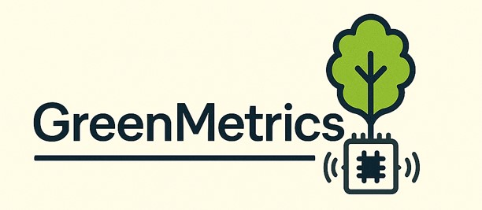

  

   

# GreenMetrics
## ¿Qué es GreenMetrics?

**GreenMetrics** es una aplicación web desarrollada como parte del Trabajo de Fin de Grado (TFG) del programa de Ingeniería Informática en la Universidad de Burgos. Su objetivo es automatizar la generación de los informes requeridos por el **UI GreenMetric World University Ranking**, un sistema de clasificación internacional que evalúa la sostenibilidad ambiental de las universidades a nivel global.

La principal función de **GreenMetrics** es optimizar el proceso de recopilación de datos y la elaboración de informes sobre diversos indicadores de sostenibilidad, que anteriormente se realizaban de manera manual. Esta automatización permite mejorar significativamente la eficiencia y reducir los errores asociados al trabajo manual. Los indicadores de sostenibilidad que se incluyen en los informes son los siguientes (aunque no de manera exclusiva):

* El número de asignaturas y programas académicos vinculados al desarrollo sostenible.

* Actividades y programas de concienciación ambiental dirigidos a la comunidad universitaria.

* Iniciativas para la reducción de emisiones de CO₂ y el uso eficiente de recursos naturales en el campus.

**GreenMetrics** permite a los usuarios seleccionar el informe específico que desean generar, introducir parámetros como el año y el curso académico, y finalmente obtener el informe de manera automatizada, en un proceso que anteriormente era mucho más largo y propenso a errores.

La aplicación se encarga de extraer, procesar y consolidar los datos necesarios para cada indicador, lo que agiliza enormemente la generación de informes. Esto reduce significativamente el tiempo y el esfuerzo involucrados en la recopilación manual de datos y la elaboración de informes, lo que se traduce en una mejora en la precisión y la velocidad del proceso.

Puedes consultar el manual de usuario pinchando en el siguiente [enlace](https://github.com/Lorenah2022/GreenMetrics/wiki/Manual-de-usuario).

***
***
## What is GreenMetrics?
**GreenMetrics** is a web application developed as part of the Final Degree Project (TFG) of the Computer Engineering programme at the University of Burgos. Its objective is to automate the generation of the reports required by the **UI GreenMetric World University Ranking**, an international ranking system that evaluates the environmental sustainability of universities globally.

The main function of **GreenMetrics** is to optimise the process of data collection and reporting on various sustainability indicators, which was previously done manually. This automation significantly improves efficiency and reduces errors associated with manual work. The sustainability indicators included in the reports are the following (although not exclusively):

* The number of academic subjects and programmes linked to sustainable development.

* Environmental awareness-raising activities and programmes aimed at the university community.

* Initiatives for the reduction of CO₂ emissions and the efficient use of natural resources on campus.

**GreenMetrics** allows users to select the specific report they wish to generate, enter parameters such as year and academic year, and finally obtain the report in an automated way, in a process that was previously much more time-consuming and error-prone.

The application takes care of extracting, processing and consolidating the data required for each indicator, which greatly speeds up reporting. This significantly reduces the time and effort involved in manual data collection and reporting, resulting in improved accuracy and speed of the process.

You can consult the user manual by clicking on the following [link](https://github.com/Lorenah2022/GreenMetrics/wiki/User-manual).